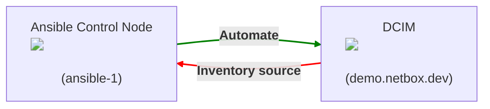

# Project - DCIM Automation

**D**ata**c**enter **I**nventory **M**anagement and IP Address Management are indispensable in today's large data centers. NetBox offers both functions including a versatile API.

<figure markdown>
  { .off-glb }
  <figcaption></figcaption>
</figure>

NetBox has curated a data model which caters specifically to the needs of network engineers and operators. It delivers a wide assortment of object types to best serve the needs of infrastructure design and documentation. These cover all facets of network technology, from IP address managements to cabling to overlays and more.

<figure markdown>
  { width="500" }
  <figcaption></figcaption>
</figure>

## Objective

The overall goal of the project is:

* [X] Create an Ansible project *from scratch*
* [X] Find Ansible modules in the documentation and use them in a playbook
* [X] Run automation against an API endpoint
* [X] Use Ansible roles
* [X] Create and use a dynamic inventory

Netbox can be used as a inventory source for your Ansible automation, but it can also be automated itself by Ansible!



!!! success "What you will do"
    **The steps 2 to 5 cover the green line, step 6 covers the red line!**

## Guide

### Step 1 - Prepare project

Create a new project folder in your home directory:

!!! tip inline end
    **Open the folder in VScode via `File` > `Open Folder ...`**

``` { .console .no-copy }
[student@ansible-1 ~]$ mkdir netbox_automation
```

We will be using a Netbox Demo available online.

Open a new browser tab and go to [https://demo.netbox.dev/](https://demo.netbox.dev/){:target="_blank"}.  

You can create [personal login credentials](https://demo.netbox.dev/plugins/demo/login/){:target="_blank"} yourself. Once logged in, you can create an [API token](https://demo.netbox.dev/user/api-tokens/add/){:target="_blank"} which you will need for your automation tasks. Either use the link or click on your username in the upper right corner of the Netbox UI and select *API Tokens* from the dropdown menu.  

!!! warning
    When creating a `V2` token (default version), you'll need the `key.token` value (the key starts with `nbt_<key value>`)!  
    Basically, copy everything **except** `Bearer `!

#### 1.1 - Get modules

To automate Netbox, you'll need additional Ansible modules. In the first part of the workshop, we only used a handful of modules which are all included in the `ansible-core` binary. With *ansible-core* only 70 of the most used modules are included:

??? example "Example output"

    ``` { .console .no-copy }
    [student@ansible-1 ~]$ ansible-doc -l
    add_host               Add a host (and alternatively a group) to the ansible-playbook in-memory inventory  
    apt                    Manages apt-packages  
    apt_key                Add or remove an apt key  
    apt_repository         Add and remove APT repositories  
    assemble               Assemble configuration files from fragments  
    assert                 Asserts given expressions are true  
    async_status           Obtain status of asynchronous task  
    blockinfile            Insert/update/remove a text block surrounded by marker lines  
    command                Execute commands on targets  
    copy                   Copy files to remote locations
    ...
    ```

Additional modules are installed through *collections*, search the [Collection Index](https://docs.ansible.com/ansible/latest/collections/index.html){:target="_blank"} for a **Provider** and **Collection** which can be used to automate Netbox or use the search field in the documentation.


If, for example, you want to create an EC2 instance in AWS, you will need the module `amazon.aws.ec2_instance`. To get the module, you'll need the collection `aws` of the provider `amazon`. Download the collection with the `ansible-galaxy` utility:

``` { .console .no-copy }
[student@ansible-1 ~]$ ansible-galaxy collection install amazon.aws
Starting galaxy collection install process
Process install dependency map
Starting collection install process
Downloading https://galaxy.ansible.com/download/amazon-aws-3.2.0.tar.gz to /home/student1/.ansible/tmp/ansible-local-55382m3kkt4we/tmp7b2kxag4/amazon-aws-3.2.0-3itpmahr
Installing 'amazon.aws:3.2.0' to '/home/student1/.ansible/collections/ansible_collections/amazon/aws'
amazon.aws:3.2.0 was installed successfully
```

!!! tip
    **Well, you won't need the AWS collection, but automating the Netbox with Ansible also requires additional modules, these are not included in the `ansible-core` binary and need to be installed with Ansible Galaxy.**

You can view the installed collections with this command:

```bash
ansible-galaxy collection list
```

``` { .console .no-copy }
[student@ansible-1 netbox_automation]$ ansible-galaxy collection list
# /home/student1/.ansible/collections/ansible_collections
Collection        Version
----------------- -------
ansible.posix     1.4.0  
community.docker  2.7.0  
community.general 5.3.0
```

#### 1.2 - Python environment

Apart from the appropriate collection you'll most likely require **additional Python packages** which are installed through the *Python package Manager `pip3`*.

Change into the previously created folder, find out the *Python interpreter* Ansible is using:

```bash
cd netbox_automation
```

```bash
ansible --version
```

!!! example

    ``` { .console hl_lines='8' .no-copy }
    [student1@ansible-1 netbox_automation]$ ansible --version
    ansible [core 2.15.13]
    config file = /etc/ansible/ansible.cfg
    configured module search path = ['/home/student1/.ansible/plugins/modules', '/usr/share/ansible/plugins/modules']
    ansible python module location = /usr/lib/python3.11/site-packages/ansible
    ansible collection location = /home/student1/.ansible/collections:/usr/share/ansible/collections
    executable location = /usr/bin/ansible
    python version = 3.11.13 (main, Aug 21 2025, 00:00:00) [GCC 11.5.0 20240719 (Red Hat 11.5.0-11)] (/usr/bin/python3.11)
    jinja version = 3.1.6
    libyaml = True
    ```

You'll need additional Python packages later on, let's create a **Python Virtual environment** to encapsulate the development environment.  
Run the following command in your project root folder:

```bash
python3.11 -m venv ve-ansible-netbox
```

Now, *activate* the Python VE:

!!! tip inline end
    You can leave your VE again by running `deactivate`.

```bash
source ve-ansible-netbox/bin/activate
```

Now, you can run the `pip3` command, for example to list all installed Python packages:

```bash
pip3 list
```

??? example

    ``` { .bash .no-copy }
    (ve-ansible-netbox) [student1@ansible-1 netbox_automation]$ pip3 list
    Package    Version
    ---------- -------
    pip        22.3.1
    setuptools 65.5.1

    [notice] A new release of pip available: 22.3.1 -> 26.1.2
    [notice] To update, run: pip install --upgrade pip
    ```

The VE is still empty, let's install Ansible (`ansible-core`) **in slightly higher version**:

```bash
pip3 install ansible-core==2.16.18
```

??? example

    When running `pip3 list` again, you'll see the installed Asible package and other dependencies:

    ``` { .bash .no-copy }
    (ve-ansible-netbox) [student1@ansible-1 netbox_automation]$ pip3 list
    Package      Version
    ------------ -------
    ansible-core 2.16.18
    cffi         2.0.0
    cryptography 48.0.0
    Jinja2       3.1.6
    MarkupSafe   3.0.3
    packaging    26.2
    pip          22.3.1
    pycparser    3.0
    PyYAML       6.0.3
    resolvelib   1.0.1
    setuptools   65.5.1

    [notice] A new release of pip available: 22.3.1 -> 26.1.2
    [notice] To update, run: pip install --upgrade pip
    ```

    If you install additional packages (**you'll have to**), ensure that they are present in the same VE with `ansible-core`.

    When running `ansible --version` again, you'll see the more recent version of Ansible and the Python interpreter used is the one from your VE:

    ``` { .bash .no-copy hl_lines="2 7" }
    (ve-ansible-netbox) [student1@ansible-1 netbox_automation]$ ansible --version
    ansible [core 2.16.18]
    config file = /home/student1/netbox_automation/ansible.cfg
    configured module search path = ['/home/student1/.ansible/plugins/modules', '/usr/share/ansible/plugins/modules']
    ansible python module location = /home/student1/netbox_automation/ve-ansible-netbox/lib64/python3.11/site-packages/ansible
    ansible collection location = /home/student1/.ansible/collections:/usr/share/ansible/collections
    executable location = /home/student1/netbox_automation/ve-ansible-netbox/bin/ansible
    python version = 3.11.13 (main, Aug 21 2025, 00:00:00) [GCC 11.5.0 20240719 (Red Hat 11.5.0-11)] (/home/student1/netbox_automation/ve-ansible-netbox/bin/python3.11)
    jinja version = 3.1.6
    libyaml = True
    ```

#### 1.3 - Ansible Configuration

Lastly, create a small Ansible configuration file in your project root folder with the following content:

```ini title="ansible.cfg"
[defaults]
interpreter_python = ve-ansible-netbox/bin/python3.11
```

This ensures that the correct Python interpreter is used where all your installed dependencies are present.

Achieve the following tasks:

* [X] Find appropriate collection for Netbox automation in the documentation
* [X] Collection installed
* [X] Python package manager installed and usable
* [X] Ansible configuration file present in project root folder

---

### Step 2 - Playbook and role

Within your newly created project folder, create a playbook file and a role skeleton (e.g. `roles/netbox_automation`). The role should contain all upcoming tasks which are automating the Netbox, the playbook should reference the role.  

!!! tip
    You have to instruct Ansible to communicate with the Netbox API, by default Ansible would try to communicate via SSH. **This will not work!** Use the API token you created in the Netbox UI.  
    **Achieving the initial successful communication with your target(s) is (in most cases) the hardest part when you are new to Ansible!** Don't be discouraged, you'll get there :smile:

You **can** achieve the solution with **or** without an inventory file!  
An Ansible *play* always needs a *target* (mostly group/groups from the inventory) and (most) Ansible modules require a Python interpreter. Instruct Ansible to use the [`local` connection](https://docs.ansible.com/projects/ansible/latest/playbook_guide/playbooks_delegation.html#local-playbooks){:target="_blank"} method (variable is called `ansible_connection` in the inventory or `connection` as a play parameter), this way Ansible will use the Python interpreter of your control node/the host you are working on (= `localhost`). The actual API endpoint and API token are provided via module parameters later on!

Testing the successful communication with the API could be done by querying all available tenants with the `nb_lookup` plugin. Take a look at the [documentation](https://docs.ansible.com/ansible/latest/index.html){:target="_blank"} for how to use it, use the *search* to find it.  
Create your playbook and add a task with the *ansible.builtin.debug* module, the `msg` utilizing the *lookup plugin*.  
In the documented example the loop uses the query function, instead of `devices` search for `tenant`, the variable to output can be `#!jinja {{ item.value.display }}` for the name of the respective tenant.  
Run your playbook, if it returns a green *ok* status and outputs tenant names, communication is established.

??? question "Help wanted?"

    Use the following task to get a list of all already configured tenants.

    ```yaml
    - name: Obtain list of tenants from NetBox
      ansible.builtin.debug:
        msg: "{{ item.value.display }}"
      loop: "{{ query('netbox.netbox.nb_lookup', 'tenants', api_endpoint='https://demo.netbox.dev/', token='YOUR_NETBOX_TOKEN') }}"
      loop_control:
        label: "ID: {{ item.key }}"
    ```

    The *loop_control* is not really necessary, but improves readability.

    !!! tip
        You need to input your personal API token.

Achieve the following tasks:

* [X] Playbook and role structure created
* [X] Use variables where possible (and useful)
* [X] Successful communication with API established

---

### Step 3 - Create a new Tenant

Most core objects within NetBox's data model support tenancy. This is the association of an object with a particular tenant to convey ownership or dependency.

The goal is to create a new Netbox tenant with Ansible. The tenant should have the following properties, which can be set with the parameters of the appropriate module:

| Parameter    | Value                    |
| ------------ | ------------------------ |
| name         | `Demo Tenant <Initials>` |
| description  | `Workshop tenant`        |
| tenant_group | `CC Workshop`            |

!!! warning
    Replace `<Initials>` with your personal initials to identify the objects later on.

!!! failure "ModuleNotFoundError?"
    You are missing a **Python dependency**!  
    Install the stated Python library with `pip3 install ...`.

Achieve the following tasks:

* [X] Tenant created
* [X] Tenant is part of `CC Workshop` tenant group
* [X] Inspect tenant in the UI

---

### Step 4 - Create group for VMs

Let's add your three *managed nodes* to a logical group within Netbox. In the Netbox UI, click on *Virtualization*, here you can find *Clusters*.  
Find an appropriate module to create a cluster and set the following module parameters:

| Parameter     | Value                        |
| ------------- | ---------------------------- |
| name          | `Demo Tenant <Initials> VMs` |
| site          | `RH Demo Environment`        |
| cluster_type  | `Amazon Web Services`        |
| cluster_group | `EMEA`                       |

Achieve the following tasks:

* [X] Cluster object created

---

### Step 5 - Create VM objects

A virtual machine (VM) represents a virtual compute instance hosted within a cluster. Each VM must be assigned to a site and/or cluster.  
Let's create multiple virtual machine objects, one for every host in your inventory group `web`.  
As we need additional information about our VMs (number of vCPU cores, memory, disk space), add a task which [*gathers facts*](https://docs.ansible.com/ansible/latest/playbook_guide/playbooks_vars_facts.html#ansible-facts){:target="_blank"} about your managed nodes. Find the appropriate module to do this, Ansible documentation shows you how to do this, the keyword here is [*delegating facts*](https://docs.ansible.com/projects/ansible/latest/playbook_guide/playbooks_delegation.html#delegating-facts){:target="_blank"}.

Once you gathered all facts about your managed nodes, add a task to create virtual machine objects in the Netbox **with a loop**, iterating over the `web` group of your inventory.  
Find the correct module, every VM object should use the following parameters:
<!-- markdownlint-disable MD060 -->
| Parameter            | Value                                                                                                                       | Example (rendered to) |
| -------------------- | --------------------------------------------------------------------------------------------------------------------------- | --------------------- |
| name                 | `#!jinja "{{ hostvars[item]['ansible_fqdn'] }}"`                                                                        | *ip-192-168-0-38.eu-west-1.compute.internal*   |
| site                 | `RH Demo Environment`                                                                                                       |                       |
| cluster              | `Demo Tenant <Initials> VMs`                                                                                                | *Demo Tenant TG VMs*  |
| tenant               | `Demo Tenant <Initials>`                                                                                                    | *Demo Tenant TG*      |
| platform             | `#!jinja "{{ hostvars[item]['ansible_distribution'] | lower }}_{{ hostvars[item]['ansible_distribution_major_version'] }}"` | *Redhat 8*            |
| vcpus                | `#!jinja "{{ hostvars[item]['ansible_processor_vcpus'] }}"`                                                                 | *2*                   |
| memory               | `#!jinja "{{ hostvars[item]['ansible_memtotal_mb'] }}"`                                                                     | *1024*                |
| disk                 | `#!jinja "{{ hostvars[item]['ansible_devices']['nvme0n1']['size'] | split(' ') | first | int }}"`                           | *10*                  |
| virtual_machine_role | `Application Server`                                                                                                        |                       |
| status               | `Active`                                                                                                                    |                       |
<!-- markdownlint-enable MD060 -->

!!! warning
    Again, replace `<initials>` with your own Initials.

Your playbook/tasks my fail here as we set the Python interpreter globally to our VE and the VE can't be found on the hosts in the web group (obviously). Add the following lines to the task (**on the same level as the `name` parameter**) which gathers the facts from the remote hosts, this will overwrite the settings in the `ansible.cfg`:

```yaml
vars:
  ansible_python_interpreter: auto
```

!!! tip
    **To also *target* the `web` group (to gather the facts of those hosts), you need to provide the Lab inventory `~/lab_inventory/hosts`!**  
    Depending on your playbook/project structure you need to provide **multiple** inventory files, by either using multiple `-i` parameters when running the playbook or as a comma-separated string in the `inventory` key in the `defaults` section of your `ansible.cfg`.

Achieve the following tasks:

* [X] VM objects for all managed nodes created

---

### Step 6 - Create and use dynamic inventory

Now that we have automated the Netbox, let's use it as an inventory source (the [red path in the objective diagram](#objective))!

Create a inventory file which retrieves the hosts from the Netbox *dynamically*, choose the correct [inventory plugin](https://docs.ansible.com/projects/ansible/latest/collections/index_inventory.html){:target="_blank"} (it is documented/referenced in the Netbox collection as well).

!!! tip
    **Take a look at the *examples* section for the inventory plugin!**

Your inventory should **filter your query** for the **site** `rh-demo-environment`.  
Also, you inventory should create groups which **group by** `platforms` and `tenants`.  

With the group for all hosts having RHEL 8, executing OS-specific tasks on all VMs is easy.

You can test the dynamic inventory with the `ansible-inventory` utility and the `--graph` parameter:

``` { .bash .no-copy }
[student1@ansible-1 netbox_automation]$ ansible-inventory -i netbox-inventory.yml --graph
[WARNING]: Invalid characters were found in group names but not replaced, use -vvvv to see details
@all:
  |--@ungrouped:
  |  |--vm1
  |  |--vm2
  |  |--vm3
  |  |--vm4
  |  |--vm5
  |  |--vm6
...
```

!!! failure "Failed to parse inventory source?"
    **Your are missing a Python dependency!**  
    Install the package stated in the first warning.

??? example "Expected outcome"

    You will most likely see additional hosts.

    ``` { .bash .no-copy }
    (ve-ansible-netbox) [student1@ansible-1 netbox_automation]$ ansible-inventory -i netbox-inventory.yml --graph
    [WARNING]: Invalid characters were found in group names but not replaced, use -vvvv to see details
    @all:
    |--@platforms_redhat_8:
    |  |--ip-192-168-0-38.eu-west-1.compute.internal
    |  |--ip-192-168-0-113.eu-west-1.compute.internal
    |  |--ip-192-168-0-197.eu-west-1.compute.internal
    |--@tenants_demo-tenant-tg:
    |  |--ip-192-168-0-38.eu-west-1.compute.internal
    |  |--ip-192-168-0-113.eu-west-1.compute.internal
    |  |--ip-192-168-0-197.eu-west-1.compute.internal
    ```

Achieve the following tasks:

* [X] Inventory can be retrieved from Netbox
* [X] Inventory is filtered by site
* [X] Inventory groups for platforms and tenants are present
