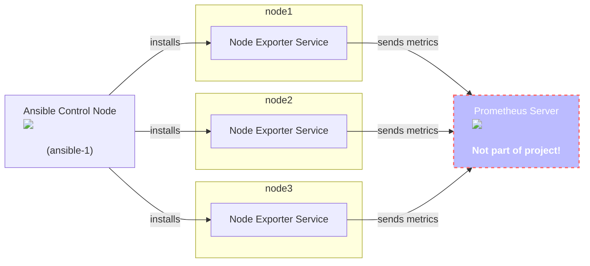

# Project - Linux automation

To further enhance your Ansible skills, let's **deploy the Prometheus Node exporter to all nodes in the demo environment**.  

**Prometheus is a systems and service monitoring system.** It collects metrics from configured targets at given intervals, evaluates rule expressions, displays the results, and can trigger alerts when specified conditions are observed.

<figure markdown>
  { width=80% .off-glb }
  <figcaption></figcaption>
</figure>

Prometheus collects metrics from targets by scraping metrics HTTP endpoints. **Node Exporter is a specialized monitoring agent** designed for Prometheus that **collects and exposes detailed system-level metrics from host machines.**

## Guide

The overall goal of the project is:

* [X] Create an Ansible project *from scratch*
* [X] Find Ansible modules in the documentation and use them in a playbook
* [X] Download a binary archive from the internet to the managed nodes
* [X] Extract a binary from the archive to an executable location on Linux
* [X] Create a Linux service which runs the node exporter binary
* [X] Use Ansible roles

The playbook runs on your Ansible Control Node (*ansible-1*) and targets all managed nodes (*node1*, *node2* and *node3*). **Only the node exporter should be installed and running as a service**, the actual Prometheus server (where the node exporter would send its metrics to) is **not** part of the project.



---

### Step 1 - Prepare project

Create a new project folder in your home directory:

``` { .console .no-copy }
[student@ansible-1 ~]$ mkdir prometheus_node_exporter
```

Create a **new inventory file**, it should define multiple groups, one for the *test environment*, one for all hosts in the *prod environment* and a *parent* group which targets all hosts.

| Group name                     | Parent group | Description                                                            |
| ------------------------------ | ------------ | ---------------------------------------------------------------------- |
| <nobr>`prometheus`</nobr>      |              | This group includes the groups `prometheus_test` and `prometheus_prod` |
| <nobr>`prometheus_test`</nobr> | `prometheus` | Holds `node1` only                                                     |
| <nobr>`prometheus_prod`</nobr> | `prometheus` | Holds `node2` **and** `node3`                                          |

Take a look at the [Ansible inventory documentation](https://docs.ansible.com/projects/ansible/latest/inventory_guide/intro_inventory.html#how-to-build-your-inventory){:target="_blank"}, especially on how to create [parent/child group relationships](https://docs.ansible.com/projects/ansible/latest/inventory_guide/intro_inventory.html#grouping-groups-parent-child-group-relationship){:target="_blank"}.

Create a new Ansible configuration file and instruct Ansible to always use the inventory you just created.

For example, you may check your inventory with the `ansible-inventory` CLI utility:

``` { .console .no-copy hl_lines='4 5 6 12' }
[student@ansible-1 ~]$ ansible-inventory --list --yaml
all:
  children:
    prometheus:
      children:
        prometheus_prod:
          hosts:
            node2:
              hostname: node2.example.com
            node3:
              hostname: node3.example.com
        prometheus_test:
          hosts:
            node1:
              hostname: node1.example.com
```

!!! info
    As you can see, no inventory was provided in the CLI call (e.g. with `-i inventory`), but the correct inventory is used.

Now, create a **new playbook file**, it should include a *play* which targets the `prometheus_test` group.

!!! warning
    **Do not target the `prometheus` group** (yet).  
    Develop and test your automation against the *test environment* first, once everything is stable, you may target all nodes (**this is done in Step 5**).

Achieve the following tasks:

* [X] Inventory file created
* [X] All necessary groups created and nodes in correct groups
* [X] Configuration file created which sets the correct inventory source
* [X] Playbook created which target the *test environment*

---

### Step 2 - Download and extract Node exporter

The Prometheus Node exporter installation basically follows [this guide](https://prometheus.io/docs/guides/node-exporter/#installing-and-running-the-node-exporter){:target="_blank"}:

1. Download the Node Exporter tarball (find the latest version tag on the [releases page](https://github.com/prometheus/node_exporter/releases/latest){:target="_blank"})
2. Extract/unarchive the tarball
3. Run the binary (done in the next step).

Add Ansible Tasks to achieve the first two steps.

**The download link can be obtained from the [Prometheus Download Page](https://prometheus.io/download/#node_exporter){:target="_blank"}**, right-click the tarball with `*linux-amd64.tar.gz` and choose copy link.

<figure markdown>
  { width=70% }
  <figcaption></figcaption>
</figure>

The content of the archive looks something like this (here the tarball was downloaded to `/tmp` and extracted):

```{ .yaml .no-copy }
$ ls -l /tmp/node_exporter-1.10.2.linux-amd64/
total 22400
-rw-r--r-- 1 node_exporter 1002    11357 Oct 25 20:10 LICENSE
-rw-r--r-- 1 node_exporter 1002      463 Oct 25 20:10 NOTICE
-rwxr-xr-x 1 node_exporter 1002 22919216 Oct 25 20:06 node_exporter # (1)!
```

1. This is the Node Exporter binary!

As you can see, the tarball was extracted into a folder with the basename of the archive (in the example `node_exporter-1.10.2.linux-amd64`), inside are three files, with the `node_exporter` binary as the most important one.

Achieve the following tasks:

* [X] Module(s) identified to download und unarchive tarball
* [X] Tarball is downloaded and unarchived on the managed node (via Ansible)

---

### Step 3 - Create Linux Service for Node exporter

The Node Exporter should run as a Linux **SystemD** service under the user `prometheus_metrics`. **The username value should be provided as a variable**, define the variable at a location of your choice.  

**Add a task that creates the user (using the variable)**, the user should not be able to login (shell should be set to `/sbin/nologin`), a home directory is also not necessary. Use the appropriate parameters of the module.

The following (**incomplete**) service file is missing the *user* and *group* (the same as the value for the *user*).
Use it as a *template* and add the missing variables. **The service file should be present at `/etc/systemd/system/node-exporter.service` on the managed node**, use an appropriate module to transfer the file to the managed node.

```{ .ini hl_lines='7 8' }
[Unit]
Description=Node Exporter
Wants=network-online.target
After=network-online.target

[Service]
User=
Group=
# Fallback when environment file does not exist
# Fallback when environment file does not exist
Environment=OPTIONS=
EnvironmentFile=-/etc/sysconfig/node_exporter
ExecStart=/usr/local/bin/node_exporter --web.systemd-socket $OPTIONS

[Install]
WantedBy=multi-user.target
```

The service file expects the binary at `/usr/local/bin/node_exporter` (see `ExecStart` parameter), **add a task which moves/copies the binary to the desired location. The binary must belong to the service user** (use the variable) **and be executable** (use `0755` permissions).

After transferrring the service file and having the binary at the correct location, the systemd service itself must be started (and should be enabled at boot)! **Add an additional task to achieve this.**

The Node Exporter exposes the metrics on Port 9100, you can check this by cURLing the `/metrics` endpoint. Run an ad-hoc command against the managed node with the argument `curl http://localhost:9100/metrics | grep node_`. The command uses a *pipe*, choose the correct module(!), the default module `command` does not support this!  
Expect an output like this:

```{ .console .no-copy }
node1 | CHANGED | rc=0 >>
# HELP node_arp_entries ARP entries by device
# TYPE node_arp_entries gauge
node_arp_entries{device="tap0"} 2
# HELP node_boot_time_seconds Node boot time, in unixtime.
# TYPE node_boot_time_seconds gauge
node_boot_time_seconds 1.772612313e+09
# HELP node_context_switches_total Total number of context switches.
# TYPE node_context_switches_total counter
node_context_switches_total 5.9358839e+07
# HELP node_cooling_device_cur_state Current throttle state of the cooling device
# TYPE node_cooling_device_cur_state gauge
node_cooling_device_cur_state{name="0",type="Processor"} 0
...
```

Achieve the following tasks:

* [X] User created **without** home directory and login shell
* [X] Service File present under `/etc/systemd/system/node-exporter.service`
* [X] Node Exporter binary present under `/usr/local/bin`
* [X] Playbook runs successful
* [X] Node exporter service is running and exporting metrics

---

### Step 4 - Re-format project to role structure

All Ansible projects should use the role structure, if your project does not already uses it, now is the time to rearrange your content.  
Create a `roles` folder and an appropriately named sub-folder for the node exporter deployment with all necessary folder and files.  
Change your playbook to use your role.

Make sure everything works by executing your playbook again.

!!! tip
    **Your playbook should target the `prometheus` group now.**  
    If you created the tasks in *idempotent* manner, you should see green Ok states on node1 and yellow Changed states for node2 and node3.

As a nice to have, your role should use **multiple** tasks files, otherwise you'll only copy the playbook tasks into the tasks file of the role.  

!!! success
    Create two additional task files (next to the `main.yml`), one for the download and extraction tasks and another one which sets up and starts the node exporter service.  

The `main.yml` tasks file should only [import the two other task file](https://docs.ansible.com/projects/ansible/latest/collections/ansible/builtin/import_tasks_module.html){:target="_blank"}.

Achieve the following tasks:

* [X] Project uses Ansible role structure
* [X] Playbook references role and targets the `prometheus` group
* [X] Playbook runs successful

Optional, but recommended:

* [ ] Role uses multiple tasks files

---

### Step 5 - Bonus: Upload project to Github

Create a new project in your personal Github account and commit your Ansible project.

---

### Step 6 - Bonus: Run your project within AAP

Create a new project in AAP, reference your node exporter project from Github as the code source. Create a template and run your playbook.
